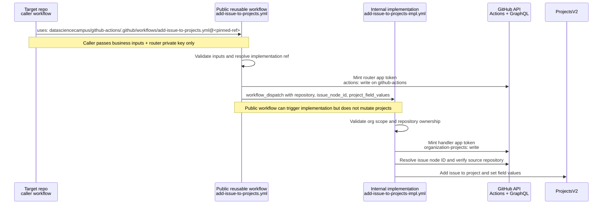
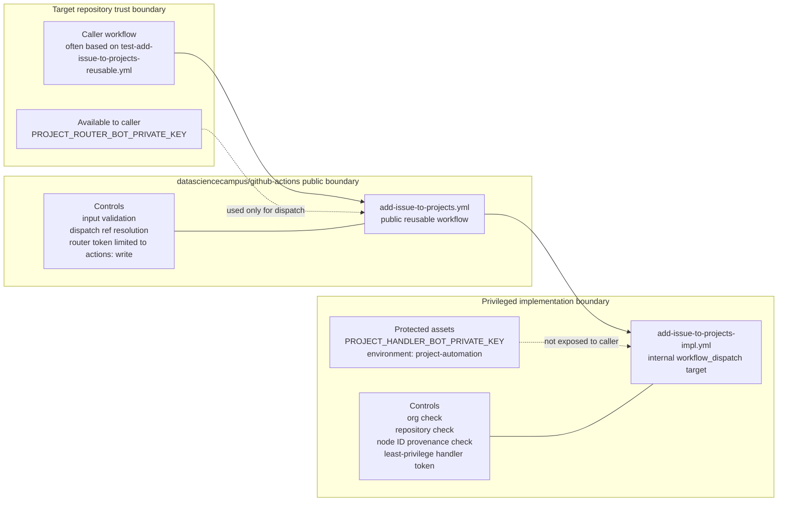
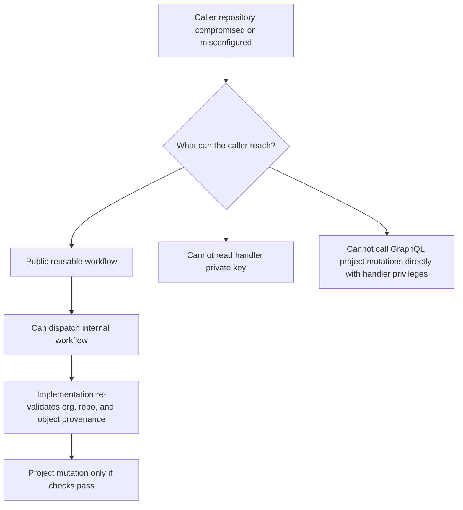
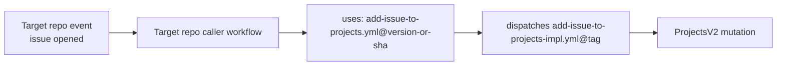

# Workflow Trust Boundaries

This repository uses a three-step flow to keep project-mutation privileges away from caller repositories:

1. A target repository runs a small caller workflow.
2. That caller invokes the public `add-*` reusable workflow in this repository.
3. The public reusable workflow dispatches the internal `*-impl` workflow, which is the only layer that uses project-mutation credentials.

The result is a narrow caller contract and a separate privileged implementation boundary.

## End-to-end flow

The diagram below uses the issue flow, but the same trust split applies to the pull request flow.

## Trust boundaries

The main security property is that the boundary with broader privileges sits inside this repository, not in every caller repository.

## Why this reduces risk

In practice, this split limits damage in a few concrete ways:

- Caller repositories only hold the router credential, which is scoped to dispatching workflows in `datasciencecampus/github-actions`.
- The public reusable workflow can validate and normalize inputs before any privileged logic runs.
- The implementation workflow owns the broader handler credential inside a protected environment in this repository.
- The implementation workflow checks that the requested organization and resolved issue or pull request actually belong to the named repository before mutating projects.
- The project-mutation path is centralized, which makes auditing, rotation, and policy changes easier than spreading privileged credentials across many repositories.

## Example caller position in the flow

For demonstration, the caller workflow in a target repository can look like the test workflow pattern used here: it gathers an issue or pull request node ID, then calls the public reusable workflow. The caller does not dispatch the internal implementation directly.

Related references:

- [ADR-0001: Called workflow owns secret usage](ADR-0001-called-workflow-owns-secret-usage.md)
- [ADR-0002: Use workflow_dispatch instead of repository_dispatch](ADR-0002-workflow-dispatch-over-repository-dispatch.md)
- [ADR-0004: Separate reusable workflow pinning from dispatch ref](ADR-0004-separate-reusable-pinning-from-dispatch-ref.md)
- [GitHub Apps reference](../reference/github-apps.md)
